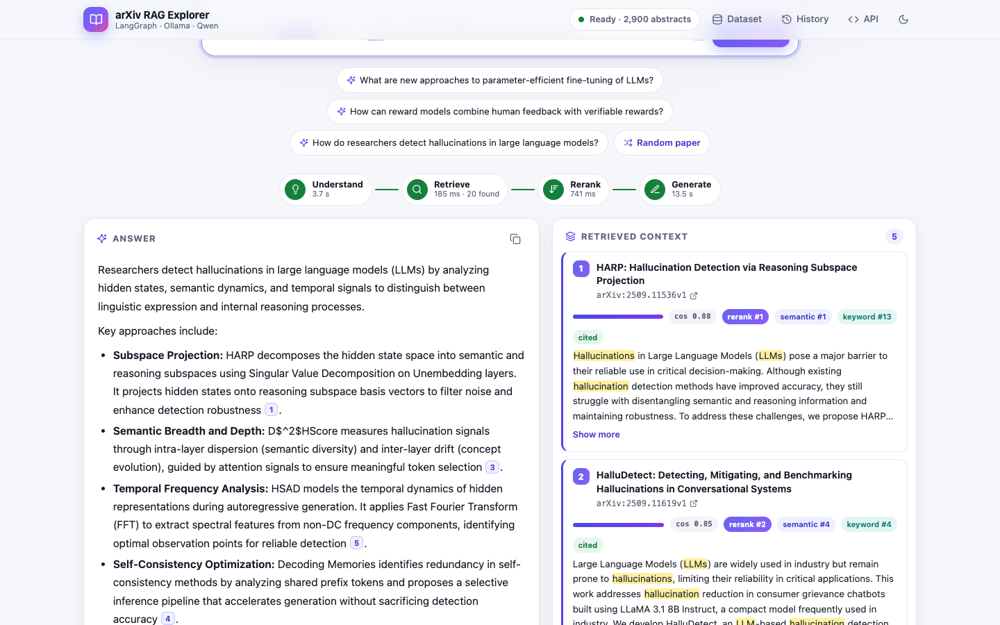
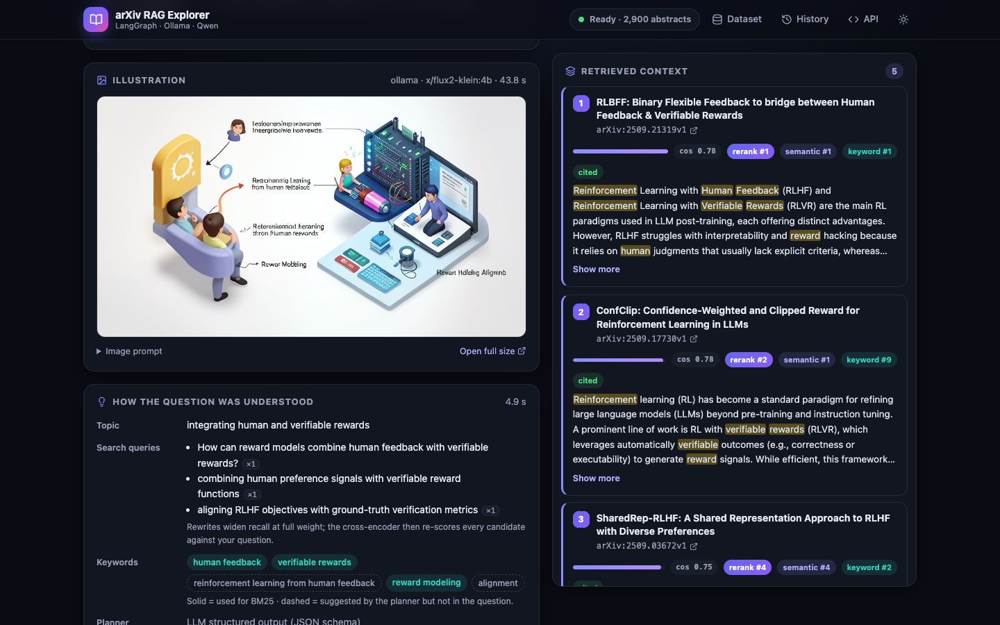
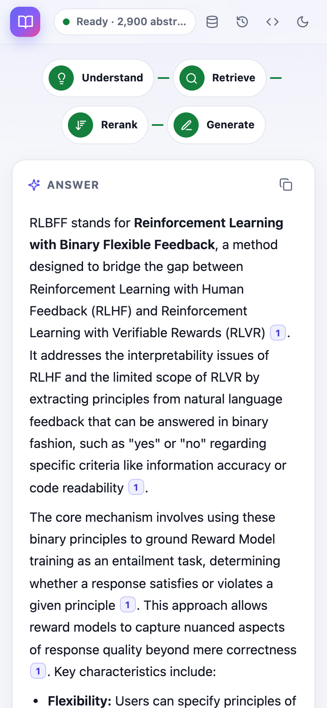
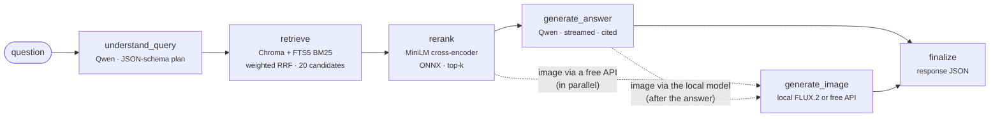
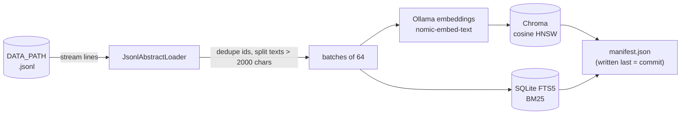

# arXiv RAG Explorer

**Grounded, cited answers over a collection of research abstracts, running 100% locally.**
LangGraph orchestrates a LangChain pipeline: query understanding with **Qwen 3.5** (via Ollama), hybrid retrieval
(**Chroma** vectors + **SQLite FTS5** BM25), local **cross-encoder reranking**, and streamed generation, with an
optional illustration (a local **FLUX.2** model on Macs, or a free image API). `python3 main.py` installs and starts
everything it needs, Ollama included.



<table><tr>
<td></td>
<td></td>
</tr></table>

---

## Contents

- [Quick start](#quick-start)
- [Start, stop and restart](#start-stop-and-restart)
- [Architecture](#architecture)
- [Using another dataset](#using-another-dataset)
- [API](#api)
- [Bonus: image generation](#bonus-image-generation)
- [Configuration](#configuration)
- [Models and hardware](#models-and-hardware)
- [Retrieval quality benchmark](#retrieval-quality-benchmark)
- [Tests](#tests)
- [Project layout](#project-layout)
- [Design decisions](#design-decisions)
- [Troubleshooting](#troubleshooting)

---

## Quick start

**Prerequisite:** Python 3.10+. That's all: no Docker, and nothing else to install by hand.

```bash
git clone https://github.com/MaorNave/arxiv-rag-explorer.git && cd arxiv-rag-explorer
python3 main.py            # Windows: py main.py      → http://127.0.0.1:8080
```

On the first run, `main.py` creates a virtual environment in `.venv` and installs `requirements.txt` into it (never
into your system Python), then relaunches itself inside it. You can also do this step yourself:
`python3 -m venv .venv && .venv/bin/pip install -r requirements.txt`. Then the app sets up everything else
**inside the project's `storage/` folder**, and the browser shows live progress:

1. **Ollama.** If an Ollama server is already running on this computer, the app uses it. Otherwise it downloads its
   own copy of Ollama into `storage/runtime/` (macOS 146 MB; Linux/Windows ~1.4 GB including GPU libraries) and
   runs it as a child process that stops when the app stops.
2. **Models:** `qwen3.5:4b` (3.3 GB) and `nomic-embed-text` (274 MB) are pulled through Ollama. Models that a
   regular Ollama installation already has are reused, not downloaded again.
3. **Index:** `data/arxiv_2.9k.jsonl` is streamed into the local index (~1.5 min on an Apple M1 Pro; reused on
   later starts).
4. **In the background, without delaying the app:**
   - the 90 MB reranker from Hugging Face (answers work meanwhile; reranking turns on when it's ready);
   - on Macs with 16 GB or more, local FLUX.2 image generation (see
     [Local images on macOS](#local-images-on-macos-flux2-klein)).

The UI is at **http://127.0.0.1:8080** and the API docs at **/docs**. Later starts take a few seconds.

> **Why isn't everything in `requirements.txt`?** pip can only install Python packages. The Python packages
> come from `requirements.txt`; Ollama and the model weights are downloaded by the app itself, so
> `python3 main.py` is the whole installation. To download Ollama, the models and the reranker up front
> instead, run `.venv/bin/python -m rag_app.setup_models` (for example `--llm qwen3.5:9b`); the optional
> local image model is still set up by the app, in the background.

---

## Start, stop and restart

The index, downloaded models and settings persist on disk, so stopping is safe and a restart takes only a few
seconds (no re-indexing, no re-downloading). Run the commands from the project folder.

| Action | macOS / Linux | Windows (PowerShell) |
|---|---|---|
| Start | `python3 main.py` | `py main.py` |
| Stop it (started in a terminal) | <kbd>Ctrl</kbd>+<kbd>C</kbd> in that terminal | <kbd>Ctrl</kbd>+<kbd>C</kbd> |
| Start in the background | `nohup python3 main.py > rag.log 2>&1 &` | `Start-Process py main.py -WindowStyle Hidden` |
| Stop it (running in the background) | `kill $(lsof -tiTCP:8080 -sTCP:LISTEN)` | `Stop-Process -Id (Get-NetTCPConnection -LocalPort 8080 -State Listen).OwningProcess` |
| Is it running? | `curl -s http://127.0.0.1:8080/health` | `Invoke-RestMethod http://127.0.0.1:8080/health` |

If you started the app with another `PORT`, use that number instead of `8080` in the stop and health commands.

**PyCharm:** open `main.py` and press ▶ *Run* (any interpreter works: missing packages are installed into the
project's `.venv` or the selected virtual environment); the ■ *Stop* button stops it.

**Ollama stops with the app**, when the app is running its own copy (and so does the local image server on macOS),
even if you stop the app in the middle of its first-run setup. The command-line tools (`rag_app.setup_models`, the
benchmark) clean up the same way after an error, <kbd>Ctrl</kbd>+<kbd>C</kbd> or `kill`. If you use your own Ollama
installation instead, it keeps running: idle models are unloaded after 30 minutes (`LLM_KEEP_ALIVE`), or right away
with `ollama stop qwen3.5:4b` and `ollama stop nomic-embed-text`.

**Start fresh:** delete the `storage/` folder (index, the app's Ollama copy and its models, the reranker, uploads and
generated images); the next `python main.py` sets everything up again.

---

## Architecture

### Query pipeline (LangGraph)



| Node | What it does |
|---|---|
| `understand_query` | Qwen (`format=json_schema`, thinking off) turns the question into 1–2 English search rewrites, keywords and a topic. Guesses are contained: BM25 only gets keywords whose words occur in the question, and an unanchored topic falls back to the question's own terms. On any failure a heuristic plan takes over. |
| `retrieve` | Embeds all queries in one batch, runs one dense search per query plus one BM25 search, and fuses everything with **weighted RRF** (`Σ w / (60 + rank)`), keeping the best chunk per paper. |
| `rerank` | A local cross-encoder reads (question, abstract) pairs together. Its ranking is blended with the hybrid ranking (RRF again) to pick the final `top_k`. If the model is unavailable, the hybrid order passes through. |
| `generate_answer` | Streams tokens from Qwen. Citations are parsed from `[n]` markers and repaired when the model writes `[Abstract 2]` or a raw doc id. |
| `generate_image` | Only when an image was requested. A free external API runs in the **same super-step** as `generate_answer` (LangGraph executes them concurrently); the local model runs right **after** the answer, so it never competes with Qwen for the GPU. Either way the image never delays the text. |
| `finalize` | Builds the response: `answer`, `citations`, `retrieved_context`, `sources`, `query_analysis`, `images`, `metrics`. |

Each node publishes progress through LangGraph's custom stream (`get_stream_writer`). `/stream` forwards these
events as Server-Sent Events, and they drive the UI's pipeline indicator.

### Indexing



- **Fingerprint** = SHA-256(dataset) + embedding model + document prefix + chunk size/overlap.
  The same content under another name reuses the index; any real change triggers a rebuild.
- **Crash-safe:** each build gets fresh, uniquely named collection and keyword files, and `manifest.json` is
  replaced atomically only after success. An interrupted build is simply rebuilt next time.
- **Model-specific prefixes:** e.g. nomic's `search_document:` / `search_query:`, applied automatically
  (`EMBED_DOC_PREFIX` / `EMBED_QUERY_PREFIX` override them for other models).
- **Live progress** (`/api/status`): processed / total, docs/s and ETA, shown in the UI as a progress bar.

---

## Using another dataset

```bash
DATA_PATH=/path/to/arxiv_5k.jsonl python main.py     # any .jsonl file
python main.py --data-path /data                     # a directory: its newest .jsonl is used
DATA_PATH=https://example.org/papers.jsonl python main.py   # downloaded (streamed) and cached
```

Each line should look like `{"id": "...", "title": "...", "abstract": "..."}`. Other fields are ignored, and common
aliases are accepted. On start the old index is discarded and a new one is built automatically. While the server
is running you can also:

- **replace the file in place**: the watcher notices within ~20 s and rebuilds (`WATCH_DATASET=true`),
- **upload a file** from the UI (*Dataset → drop a .jsonl*) or with `POST /api/dataset`,
- **force a rebuild** with *Dataset → Rebuild index* or `POST /api/reindex`.

> **Docker-command equivalent.** The assignment's example sets `DATA_PATH=/data/arxiv_5k.jsonl` but mounts
> `arxiv_2.9k.jsonl`. If `DATA_PATH` names a file that doesn't exist, the app uses the `.jsonl` next to it and logs
> a warning instead of failing.

---

## API

Interactive docs: **http://127.0.0.1:8080/docs**.

### `POST /answer` (JSON)

```bash
curl -s -X POST http://127.0.0.1:8080/answer \
  -H 'Content-Type: application/json' \
  -d '{"query": "What techniques make diffusion models generate images in only a few steps?", "top_k": 5, "generate_image": false}'
```

Also `GET /answer?query=...&top_k=5&generate_image=false`. The body accepts `query` (aliases `question`, `q`),
`top_k` (1–20) and `generate_image`.

<details><summary>Example response (real output, trimmed with "...")</summary>

```json
{
  "answer": "Several techniques described in the abstracts enable diffusion models to generate images or text in significantly fewer sampling steps, primarily by altering the sampling trajectory or model architecture.\n\n* **Penalizing Boundary Activation:** ... during early denoising steps [1]. ...\n* **Rectified Flow:** The RFfusion approach incorporates Rectified Flow to straighten the sampling path, enabling one-step sampling for image fusion tasks [5]. ...\n* **Few-Step Discrete Flow-Matching (FS-DFM):** ... trains the model to be consistent across different step budgets [4]. ...\n* **Cascaded Low-Resolution Generation:** LowDiff ... generates images progressively from low resolution to high resolution using a unified model [3]. ...",
  "citations": [
    {"ref": 1, "doc_id": "2509.16968v2", "title": "Penalizing Boundary Activation for Object Completeness in Diffusion Models", "url": "https://arxiv.org/abs/2509.16968v2"},
    {"ref": 5, "doc_id": "2509.16549v2", "title": "Efficient Rectified Flow for Image Fusion", "url": "https://arxiv.org/abs/2509.16549v2"},
    {"ref": 4, "doc_id": "2509.20624v1", "title": "FS-DFM: Fast and Accurate Long Text Generation with Few-Step Diffusion Language Models", "url": "https://arxiv.org/abs/2509.20624v1"},
    {"ref": 3, "doc_id": "2509.15342v1", "title": "LowDiff: Efficient Diffusion Sampling with Low-Resolution Condition", "url": "https://arxiv.org/abs/2509.15342v1"}
  ],
  "retrieved_context": ["Diffusion models have emerged as a powerful technique for text-to-image (T2I) generation, creating high-quality ...", "..."],
  "sources": [
    {"ref": 1, "doc_id": "2509.16968v2", "chunk_id": "2509.16968v2#0", "title": "Penalizing Boundary Activation for Object Completeness in Diffusion Models",
     "text": "...", "score": 0.04817, "similarity": 0.8329, "dense_rank": 1, "keyword_rank": 11, "hybrid_rank": 5,
     "rerank_rank": 1, "rerank_score": 4.137, "url": "https://arxiv.org/abs/2509.16968v2"},
    "..."
  ],
  "query_analysis": {
    "search_queries": ["accelerated diffusion sampling methods few-step image generation", "distillation techniques for fast diffusion model inference"],
    "keywords": ["diffusion models", "few-shot sampling", "distillation", "inference speed", "latent diffusion"],
    "topic": "accelerated diffusion image generation",
    "queries_used": ["What techniques make diffusion models generate images in only a few steps?", "accelerated diffusion sampling methods few-step image generation", "distillation techniques for fast diffusion model inference"],
    "query_weights": [1.0, 1.0, 1.0],
    "bm25_keywords": ["diffusion models"],
    "method": "llm"
  },
  "images": [],
  "image_error": null,
  "metrics": {
    "latency_ms": 14486.1, "total_ms": 14487.9, "analysis_ms": 4253.5, "retrieval_ms": 180.6, "rerank_ms": 664.1,
    "generation_ms": 9383.2, "time_to_first_token_ms": 444.4, "image_ms": null, "prompt_tokens": 1644,
    "completion_tokens": 314, "tokens_per_second": 35.1, "model": "qwen3.5:4b", "embedding_model": "nomic-embed-text",
    "top_k": 5, "candidates": 20,
    "retrieval_mode": "hybrid: dense (Chroma) + BM25 (SQLite FTS5), Reciprocal Rank Fusion + cross-encoder rerank (cross-encoder/ms-marco-MiniLM-L6-v2)"
  }
}
```

Note how the plan's guessed keywords ("few-shot sampling", "latent diffusion") were *not* sent to BM25, and how the
reranker promoted a paper from hybrid rank 5 to rank 1.
</details>

### `POST /stream` (Server-Sent Events)

```bash
curl -N -X POST http://127.0.0.1:8080/stream -H 'Content-Type: application/json' -d '{"query": "What is RLBFF?"}'
curl -N "http://127.0.0.1:8080/stream?query=What%20is%20RLBFF%3F"     # GET works with EventSource too
```

| Event | Payload |
|---|---|
| `step` | `{step, status: running/done, ms?}` for `understand`, `retrieve`, `rerank`, `generate`, `image` |
| `analysis` | the query plan (rewrites with their RRF weights, keywords, topic) |
| `retrieval` | the final passages, after reranking |
| `token` | `{text}`: answer tokens as they are generated |
| `thinking` | reasoning tokens (only with `LLM_THINKING=true`) |
| `answer` | `{answer, citations}`: the text is complete (the image may still be generating) |
| `image` | `{images, error, prompt, ms}` |
| `final` | the full response, identical to `/answer` |
| `error`, `done` | failure details / end of stream |

### Operations

| Endpoint | Purpose |
|---|---|
| `GET /api/status` | lifecycle state, download/indexing progress, dataset & index details, models |
| `GET /health` | `200 {"status":"ok"}` when ready, otherwise `503` |
| `POST /api/reindex` | discard and rebuild the index |
| `POST /api/dataset` | upload a new `.jsonl` (multipart), which then replaces the index |
| `GET /api/examples` | random paper titles (example questions for any dataset) |

---

## Bonus: image generation

Tick **Generate image** in the UI (or send `"generate_image": true`). Only **free** options are used, tried in this
order, and if one fails the next one is used automatically:

| # | Provider | Cost | Setup |
|---|---|---|---|
| 1 | **Local model via Ollama** (`x/flux2-klein:4b`, FLUX.2 [klein], Apache-2.0) | free, offline | automatic on Macs with ≥ 16 GB (see [below](#local-images-on-macos-flux2-klein)) |
| 2 | **Cloudflare Workers AI** (FLUX.1 schnell) | free plan: 10,000 neurons/day ≈ 170 images/day | free Cloudflare account → *AI → Workers AI* → create an API token with the *Workers AI* permission, then set `CLOUDFLARE_ACCOUNT_ID` and `CLOUDFLARE_API_TOKEN` |
| 3 | **Pollinations.ai** (FLUX) | free | nothing (keyless, rate-limited and watermarked); a free account key in `POLLINATIONS_TOKEN` removes the watermark |

How it is wired:

- **The text is never slowed down.** External APIs run in a parallel LangGraph branch next to the answer. The local
  model shares the GPU with Qwen, so it starts *after* the answer is complete (the UI step says "after answer").
- **The JSON response** contains `images: [{url, prompt, provider, model, latency_ms}]`; files are served from
  `/generated/`. If every provider fails, `image_error` explains why, and the answer is unaffected.
- **No extra LLM call:** the image prompt is built deterministically from the query plan (topic + keywords).
- **Force one provider** with `IMAGE_PROVIDER=ollama|cloudflare|pollinations`, or disable the feature with
  `IMAGE_PROVIDER=none`. Models: `OLLAMA_IMAGE_MODEL`, `CLOUDFLARE_IMAGE_MODEL`, `POLLINATIONS_MODEL`.

### Local images on macOS (FLUX.2 klein)

Ollama added local image generation in January 2026, then **temporarily removed it in version 0.32.6**; its
release notes say to *"continue using 0.32.5 for image generation support"*. The app handles this by itself, with
nothing to run or install by hand:

- **Automatic on Macs with ≥ 16 GB RAM** (`LOCAL_IMAGES=auto`; `on` forces it, `off` disables it). In the background
  after startup, the app downloads Ollama 0.32.5 into `storage/runtime/` (146 MB) and runs it on
  `127.0.0.1:11435` for images only. It reuses `x/flux2-klein:4b` from your regular Ollama when present (zero-copy
  clones); otherwise it downloads the model (5.7 GB). The image toggle shows the progress.
- **Your regular Ollama is untouched** and keeps serving Qwen. While it is 0.32.6 or newer, image requests go only
  to the app's 0.32.5 server, even if your Ollama has the model too. If the app is running its own Ollama anyway (no
  Ollama on the machine), that same copy serves images too.
- **It starts and stops with the app.** While it's being set up, or if it fails, the free APIs are used.
- **The answer is not slowed down.** Local images start once the answer is complete. Measured on an M1 Pro with
  16 GB: the answer took ~16–20 s as usual, then a 1024×576 image took ~40–50 s, peaking at ~7.6 GB of memory.
- On Linux and Windows the app uses the free external APIs. Set `OLLAMA_IMAGE_BASE_URL` to use another Ollama
  server for images.

**Why no Gemini, OpenAI or Hugging Face?** They aren't free for image generation through their APIs (checked
October 2026). Gemini's "Nano Banana" models have no free API tier: they're free only inside the Gemini / AI Studio
web apps, which a program can't call. OpenAI image models require paid credits, and free Hugging Face accounts get no
Inference Providers credits. To keep the project free, only free providers are built in.

---

## Configuration

All settings are environment variables (or `.env`). See [`.env.example`](.env.example) for the full,
commented list. The main ones:

| Variable | Default | Meaning |
|---|---|---|
| `DATA_PATH` | `data/arxiv_2.9k.jsonl` | dataset file, directory or URL |
| `HOST` / `PORT` | `127.0.0.1` / `8080` | web server |
| `OLLAMA_BASE_URL` | `http://127.0.0.1:11434` | also honours `OLLAMA_HOST` |
| `MANAGED_OLLAMA` | `true` | no Ollama running on a local URL → the app downloads and runs its own copy in `storage/runtime/` |
| `LOCAL_IMAGES` | `auto` | local FLUX.2 images on macOS: `auto` (≥ 16 GB RAM), `on`, `off` |
| `LLM_MODEL` | `qwen3.5:4b` | any Ollama chat model |
| `EMBED_MODEL` | `nomic-embed-text` | any Ollama embedding model (`bge-m3` for multilingual) |
| `AUTO_PULL_MODELS` | `true` | download missing models on startup |
| `TOP_K` | `5` | abstracts given to the LLM (UI slider: 1–10, API: 1–20) |
| `QUERY_REWRITE` | `true` | LLM query understanding (else a keyword heuristic) |
| `RERANKER_MODEL` | `cross-encoder/ms-marco-MiniLM-L6-v2` | `none` disables reranking |
| `REWRITE_WEIGHT` / `KEYWORD_WEIGHT` | `auto` | RRF weights (1.0/1.0 with the reranker, 0.25/1.5 without) |
| `LLM_THINKING` | `false` | let Qwen think first; the reasoning streams into a collapsible panel |
| `LLM_KEEP_ALIVE` | `30m` | how long Ollama keeps the models loaded after a request (Ollama durations: `10m`, `1h30m`; `-1` = always) |
| `STORAGE_DIR` | `storage` | index, models, uploads, images |
| `IMAGE_PROVIDER` | `auto` | `auto` (local → Cloudflare → Pollinations), `ollama`, `cloudflare`, `pollinations` or `none`; see [image generation](#bonus-image-generation) |

CLI flags override the environment: `python main.py --data-path ... --port 9000 --llm qwen3.5:9b`.

---

## Models and hardware

| Component | Default | Download | Runs on |
|---|---|---|---|
| Ollama runtime | your running Ollama, else the app's own 0.32.5 copy | 146 MB (macOS) / ~1.4 GB (Linux, Windows) | `storage/runtime/` |
| LLM | `qwen3.5:4b` | 3.3 GB | Ollama (Metal / CUDA / CPU) |
| Embeddings | `nomic-embed-text` (768-d) | 274 MB | Ollama |
| Reranker | `cross-encoder/ms-marco-MiniLM-L6-v2` | 90 MB | ONNX Runtime, CPU |

| RAM | Suggested `LLM_MODEL` |
|---|---|
| 4 GB | `qwen3.5:0.8b` (1.3 GB) or `qwen3:1.7b` (1.4 GB) |
| 8 GB (recommended) | `qwen3.5:4b` (default) |
| 16 GB+ | `qwen3.5:9b` (6.6 GB) for richer answers |

Measured on an Apple M1 Pro (16 GB): indexing 2,900 abstracts takes ~83 s (~35 docs/s); a later start loads the
index in ~1 s. A typical question costs ~4 s of planning, ~0.2–0.9 s of retrieval, ~0.6 s of reranking and the
first answer token ~3–5 s later. Generation then runs at ~35 tokens/s, so a full answer takes ~12–25 s. On a
CPU-only machine everything works, just slower. Pick a smaller model, or set `QUERY_REWRITE=false` to skip the
planning call.

---

## Retrieval quality benchmark

`scripts/eval_retrieval.py` measures whether the paper that answers a question is retrieved. It needs no labelled
data: the local LLM writes the questions from random abstracts, and each question has exactly one relevant paper.

- **semantic**: natural search-engine questions (n=40)
- **paraphrased**: the same papers, but the question must avoid the abstract's terminology (n=40). This
  vocabulary mismatch is closest to how non-experts ask.
- **named**: "What is RLBFF?"-style lookups of papers whose title starts with a name/acronym (n=20)

Results with k=5 on the bundled dataset (`qwen3.5:4b`, `nomic-embed-text`):

| Strategy | semantic hit@5 | paraphrased hit@5 | paraphrased MRR@5 | named hit@1 | named hit@5 |
|---|---|---|---|---|---|
| dense only | 0.97 | 0.57 | 0.45 | 0.60 | 0.85 |
| BM25 only | 1.00 | 0.45 | 0.37 | 0.95 | 0.95 |
| hybrid (RRF) | 1.00 | 0.60 | 0.46 | 0.85 | 0.95 |
| hybrid + LLM query plan | 1.00 | 0.62 | 0.47 | 0.95 | 1.00 |
| **hybrid + plan + rerank (default)** | **1.00** | **0.80** | **0.59** | **0.95** | **1.00** |

The *named* columns of the dense and hybrid rows move by one or two of the 20 queries between runs (±0.05–0.10):
Chroma's approximate nearest-neighbour search isn't bit-identical from one process to the next, although the
embeddings are. The default pipeline's row was identical in every run we compared.

Reranking adds ~0.57 s per question. The benchmark drove three design decisions:

1. **Weighted fusion.** Giving LLM rewrites full weight without a reranker let a drifting rewrite (e.g. a guessed
   acronym expansion) outvote the question.
2. **Question-anchored BM25 keywords.** Planner keywords such as "latent diffusion" for a question about
   "diffusion" were pulling exact matching off-topic.
3. **The cross-encoder.** It's the only configuration that is best or tied-best on every query set.

Run it yourself (several minutes the first time, while the local LLM writes the questions and query plans; about
1.5 min once they are cached; on Windows use `.venv\Scripts\python`):

```bash
.venv/bin/python scripts/eval_retrieval.py --n 40 --named 20 --k 5
```

Stop the web app first and keep it stopped during the run: the two would compete for the GPU, and an Ollama the
script starts is stopped when it ends. Like `main.py`, the script uses a running Ollama or sets up the app's own
copy, and pulls missing models. The generated questions and query plans are cached in `storage/eval_*.json` (delete
them to regenerate), so an interrupted run resumes where it stopped.

---

## Tests

```bash
.venv/bin/pip install -r requirements-dev.txt    # adds pytest to the project's .venv
.venv/bin/python -m pytest -q                    # 58 tests, ~4 s, fully offline
```

(On Windows use `.venv\Scripts\pip` and `.venv\Scripts\python`.) The suite never touches Ollama or the network: it
uses deterministic bag-of-words embeddings, LangChain's `GenericFakeChatModel`, mocked HTTP and a fake
`ollama serve`. It covers:

- streaming loading, malformed and duplicate records, `DATA_PATH` fallbacks;
- fingerprint reuse vs rebuild, cleanup of old indexes, forced rebuilds, `LLM_KEEP_ALIVE` durations;
- hybrid retrieval and its ablation modes, weighted fusion, reranker blending;
- citation parsing;
- the API schema, the SSE event order, validation errors, `503` before the index exists, and dataset upload →
  rebuild;
- startup: answers while the reranker is still downloading or after it failed, and a failed Ollama setup that keeps
  its reason on screen;
- the app's own Ollama: download and unpack, start/stop, reuse of models from an existing Ollama, and that stopping
  the app mid-setup or interrupting a start never leaves a server running;
- the image branch: success, failure, and the guarantee that a slow image doesn't delay the answer;
- the free image chain (local Ollama, Cloudflare Workers AI, Pollinations) against mocked HTTP: fallbacks,
  error messages, which Ollama server gets the local model, and that it runs after the answer instead of competing
  with it.

---

## Project layout

```
├── main.py                  # python main.py → http://127.0.0.1:8080 (sets up .venv on the first run)
├── requirements.txt         # runtime deps (models are pulled automatically, see Quick start)
├── requirements-dev.txt     # + pytest
├── .env.example             # every setting, documented
├── data/arxiv_2.9k.jsonl    # sample dataset (arXiv metadata)
├── docs/                    # screenshots used in this README
├── rag_app/
│   ├── __main__.py          # python -m rag_app: CLI flags, logging, web server
│   ├── config.py            # settings from env / .env
│   ├── dataset.py           # DATA_PATH resolution, streaming LangChain loader, fingerprinting
│   ├── embeddings.py        # Ollama embeddings + model-specific task prefixes
│   ├── keyword_index.py     # SQLite FTS5 BM25 index
│   ├── index_manager.py     # build / load / swap / discard the index (Chroma + FTS5)
│   ├── retriever.py         # HybridRetriever (LangChain BaseRetriever), weighted RRF
│   ├── reranker.py          # ONNX cross-encoder + rank blending
│   ├── llm.py               # ChatOllama factories, structured query plan
│   ├── prompts.py           # analysis and answer prompts
│   ├── graph.py             # LangGraph pipeline (nodes, fan-out, streaming events)
│   ├── images.py            # bonus image providers
│   ├── service.py           # startup orchestration, dataset watcher, answer/stream
│   ├── server.py            # FastAPI: UI, /answer, /stream, /api/*
│   ├── schemas.py           # request/response models of the API
│   ├── status.py            # startup / indexing progress shared with the UI
│   ├── setup_models.py      # Ollama checks + model downloads (also an optional CLI)
│   ├── runtime.py           # the app's own Ollama: download, start/stop, model reuse
│   └── static/              # the web UI (vanilla HTML/CSS/JS, no build step)
├── scripts/
│   └── eval_retrieval.py    # retrieval benchmark
├── tests/                   # offline pytest suite
└── storage/                 # created on the first run, git-ignored: index/, models/ (reranker), runtime/
                             #   (the app's own Ollama and its models), images/, uploads/, downloads/
```

---

## Design decisions

- **Ollama for every model call, installed by the app itself.** One local runtime serves the LLM, the embeddings
  and (on macOS) images, with GPU acceleration where available and CPU otherwise. When no Ollama is running, the
  app downloads and supervises its own copy in `storage/` and never leaves it running behind it. Together with model
  pulls through the Ollama API, this is what makes `python main.py` the whole installation, without Docker.
- **Qwen 3.5 4B with thinking off.** It is fast (~35 tok/s on an M1) and its structured-output support makes query
  planning reliable. Thinking can be switched on (`LLM_THINKING=true`): the reasoning streams into a collapsible
  panel and an extra token budget is reserved for it. Expect answers to take ~4× longer (≈60 s instead of ≈15 s).
- **`nomic-embed-text` over `bge-m3`.** It indexes ~3× faster (≈83 s vs ≈4 min for this dataset) with equal
  results on our probes. Indexing speed matters because every new dataset triggers a rebuild, and on CPU-only
  machines it decides whether startup takes minutes or an hour. Cross-lingual questions still work: the planner
  translates them into English queries (ask in Hebrew, get a Hebrew answer grounded in English abstracts).
- **Chroma + SQLite FTS5 instead of one hybrid engine.** Chroma's hybrid search API is cloud-only. FTS5 ships with
  Python, lives on disk (so the dataset never has to fit in memory) and gives proper BM25. Fusion is a few lines of
  RRF.
- **Whole abstracts as chunks.** Every abstract fits easily in the embedding context, and one chunk per paper keeps
  citations clean. Longer texts (other datasets) are split with LangChain's `RecursiveCharacterTextSplitter`.
- **Blue/green-style index lifecycle.** Every build writes uniquely named collection and keyword files and commits
  by atomically replacing `manifest.json`, so a crash or a forced rebuild never corrupts or reuses the files of the
  index being served (a bug the test suite caught and now guards against).
- **Streaming everywhere.** Tokens, pipeline steps and partial results stream to the UI, so the user sees progress
  within a second even though a local 4B model needs ~15 s for a full answer.
- **No Docker (by choice).** The app runs natively (`python main.py`) and is published as a buildable repository.
  Everything a container would provide is still here: one command, local models, a configurable `DATA_PATH` and
  port `8080`.

---

## Troubleshooting

| Symptom | Fix |
|---|---|
| UI says *Waiting for Ollama* | `OLLAMA_BASE_URL` points to another machine (or `MANAGED_OLLAMA=false`): start Ollama there. The page continues by itself once Ollama answers. |
| UI says *Could not set up Ollama automatically* | The app couldn't download or start its own Ollama, and the message says why (e.g. no internet on the first run). Fix that and restart the app, or start Ollama yourself: the page continues by itself once it answers. |
| First start is slow | Ollama and the models are downloading into `storage/`; progress is shown in the UI and the terminal. Later starts take seconds. |
| The first answer after a while is slow | Ollama unloads idle models after `LLM_KEEP_ALIVE` (30 min). Other apps using *different* Ollama models at the same time can also force model swaps. |
| Out of memory / very slow on CPU | Use a smaller `LLM_MODEL` (see [hardware](#models-and-hardware)), lower `LLM_NUM_CTX` to `4096`, or set `QUERY_REWRITE=false`. |
| `Reranker unavailable` in the logs | The first run couldn't reach Hugging Face. The app keeps working without reranking; it retries on the next start. Disable it with `RERANKER_MODEL=none`. |
| Image: *keyless tier is rate-limited / failed* | The keyless tier is best-effort (rate limits, occasional outages). Add a free `POLLINATIONS_TOKEN` or a free Cloudflare Workers AI account (see [image generation](#bonus-image-generation)). |
| Image: *This Ollama version cannot generate images* | Expected with Ollama ≥ 0.32.6. On Macs with ≥ 16 GB the app sets up its own Ollama 0.32.5 image server automatically (`LOCAL_IMAGES`); meanwhile, and elsewhere, the free APIs are used. |
| Port 8080 is busy | `PORT=9000 python main.py` |

---

Dataset: arXiv metadata (CC0). Code: [MIT](LICENSE).
